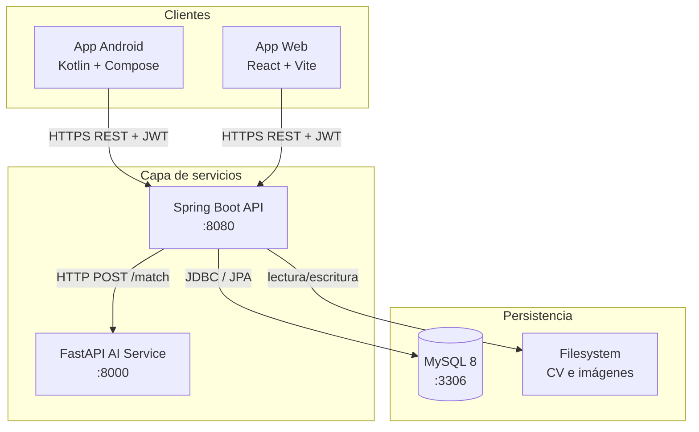
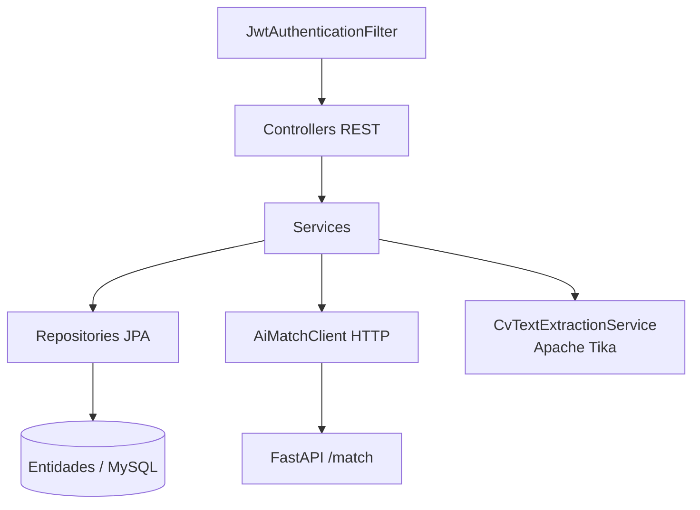
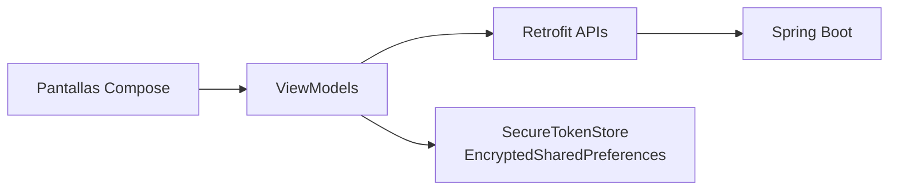
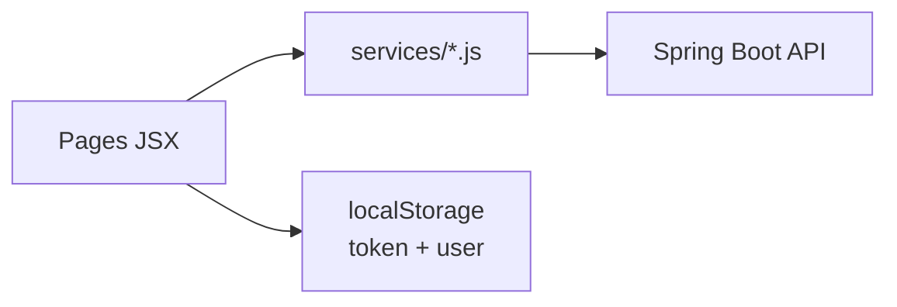
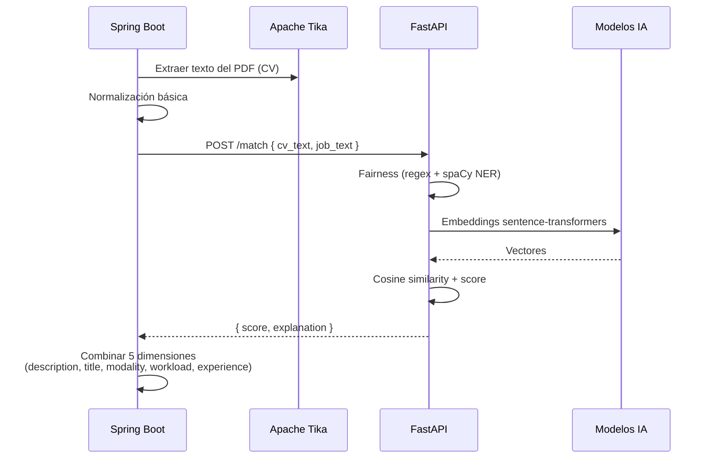
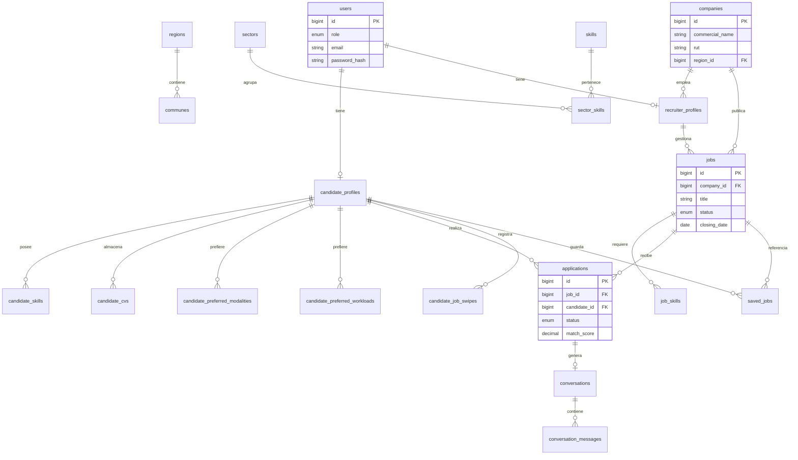
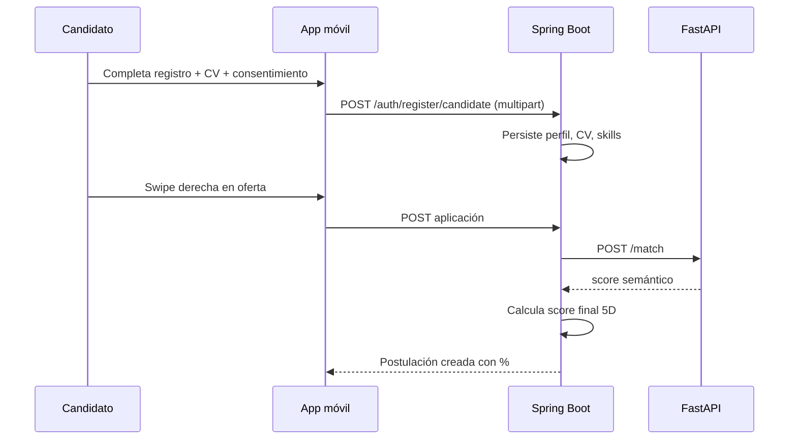

# WorkSí — Estructura y arquitectura del proyecto

Documento de referencia académica que describe la organización del repositorio, la arquitectura de software, el modelo de datos, los flujos principales y la infraestructura de despliegue.

---

## 1. Visión general

WorkSí es una plataforma de reclutamiento con tres clientes y dos servicios backend:

- **App móvil (CANDIDATE):** exploración de ofertas, postulación, perfil y mensajería.
- **App web (ADMIN / RECRUITER):** administración del sistema y operación de ofertas por empresa.
- **Backend monolítico (Spring Boot):** API REST, autenticación, persistencia y orquestación.
- **Servicio de IA (FastAPI):** fairness, embeddings y cálculo de similitud semántica.
- **MySQL 8:** base de datos relacional única.



---

## 2. Estructura del repositorio

### 2.1 Raíz

| Ruta | Propósito |
|------|-----------|
| `README.md` | Descripción general, tecnologías, equipo y arranque rápido |
| `integrantes.txt` | Nombres completos del equipo |
| `documentacion/` | Documentación técnica, workflow y arquitectura |
| `gestion/` | Documento de definición e identificación del proyecto |
| `producto/` | Código fuente ejecutable y Docker Compose |

### 2.2 Carpeta `producto/`

```
producto/
├── docker-compose.yml      Orquestación: MySQL + backend + IA
├── README.md               Guía de arranque y verificación local
├── backend/                Monolito Spring Boot
│   ├── Dockerfile
│   ├── pom.xml
│   └── src/main/
│       ├── java/cl/duoc/worksi/
│       │   ├── controller/     Controladores REST
│       │   ├── service/        Lógica de negocio
│       │   ├── repository/     Acceso a datos (JPA)
│       │   ├── entity/         Entidades JPA
│       │   ├── dto/            Objetos de transferencia (API snake_case)
│       │   ├── security/       JWT y filtros de autenticación
│       │   ├── config/         Configuración Spring
│       │   ├── validation/     Reglas de negocio (RUT, contraseña)
│       │   ├── client/         Cliente HTTP hacia servicio IA
│       │   └── exception/      Manejo global de errores
│       └── resources/
│           ├── application.properties
│           └── db/migration/   Migraciones Flyway (V1–V22)
├── ai-service/             Microservicio Python
│   ├── Dockerfile
│   ├── requirements.txt
│   ├── app/
│   │   ├── main.py             Endpoints FastAPI
│   │   └── match_core.py       Pipeline fairness + embeddings
│   └── tests/
├── frontWeb/               SPA React
│   ├── package.json
│   └── src/
│       ├── pages/              Pantallas por rol y flujos
│       ├── components/         Componentes reutilizables
│       ├── services/           Clientes API
│       └── utils/
└── frontmovil/             App Android
    ├── build.gradle.kts
    └── app/src/main/java/com/worksi/app/
        ├── ui/                 Pantallas Compose + ViewModels
        ├── data/               API, modelos, almacenamiento seguro
        └── validation/
```

### 2.3 Carpeta `documentacion/`

| Contenido | Descripción |
|-----------|-------------|
| `ESTRUCTURA-Y-ARQUITECTURA.md` | Este documento |
| `Documentación de workflow/` | Contrato API, HU, sprints, flujos de pantallas, stack y reglas |
| Informes y recursos académicos | Material complementario de entrega |

### 2.4 Carpeta `gestion/`

| Archivo | Descripción |
|---------|-------------|
| `DOCUMENTO-DEFINICION-IDENTIFICACION.md` | Registro formal del proyecto |

---

## 3. Arquitectura de capas (backend)

El backend sigue una arquitectura monolítica en capas:



### 3.1 Controladores REST

| Controlador | Prefijo / responsabilidad |
|-------------|---------------------------|
| `HealthController` | `GET /health` |
| `AuthController` | `POST /api/v1/auth/login` |
| `PasswordRecoveryController` | Recuperación de contraseña MVP |
| `CandidateRegistrationController` | Registro multipart candidato |
| `CatalogController` | Catálogos públicos (regiones, sectores, skills) |
| `CandidateProfileController` | Perfil del candidato autenticado |
| `CandidateCvController` | CV del candidato |
| `CandidateJobsController` | Feed de ofertas, swipe, guardados |
| `CandidateApplicationsController` | Postulaciones del candidato |
| `AdminController` | CRUD empresas, reclutadores, ofertas globales |
| `CompanyController` | Operaciones del reclutador (ofertas, postulantes) |
| `MessagingController` | Conversaciones y mensajes |

### 3.2 Convenciones API

- JSON expuesto: **snake_case**
- Código Java interno: **camelCase**
- Autenticación: **JWT access token** (sin refresh token)
- Roles: `CANDIDATE`, `ADMIN`, `RECRUITER`

---

## 4. Arquitectura de clientes

### 4.1 App móvil (Kotlin / Jetpack Compose)



**Módulos de pantallas principales:**

| Módulo | Pantallas |
|--------|-----------|
| Autenticación | Splash, Welcome, Login, Recuperación |
| Registro | Datos personales, CV, skills, preferencias, consentimiento |
| Sesión | Home (swipe), JobDetail, Applications, SavedJobs |
| Perfil | Profile, ProfileEdit |
| Matchs | MatchsScreen, MatchThread, LoginNotice |

### 4.2 App web (React / Vite)



**Portales:**

| Portal | Rutas principales |
|--------|-------------------|
| ADMIN | Empresas, reclutadores, ofertas globales, configuración |
| RECRUITER | Dashboard, ofertas (CRUD), postulaciones, score, matchs, mensajes |
| Recuperación | `/recovery/*` (flujo MVP alineado al contrato API) |

---

## 5. Servicio de inteligencia artificial

Servicio desacoplado en Python. El backend Java **no envía PDFs**; envía texto ya extraído y normalizado.



### 5.1 Pipeline de fairness

1. **Regex:** edad, género, nacionalidad, email, RUT, institución, años de experiencia en texto.
2. **spaCy NER:** entidades PERSON, ORG, GPE en texto libre.
3. **Cierre regex:** captura de escapes de formato.

Objetivo: reducir sesgos eliminando atributos sensibles antes del embedding.

### 5.2 Dimensiones del score final

| Dimensión | Origen |
|-----------|--------|
| description_score | Similitud semántica CV ↔ descripción oferta |
| title_score | Similitud semántica CV ↔ título oferta |
| modality_score | Modalidad oferta vs preferencias candidato |
| workload_score | Carga horaria oferta vs preferencias candidato |
| experience_score | Años requeridos vs `years_experience` del perfil |

El desglose (`match_breakdown`) se expone al reclutador en la web.

---

## 6. Modelo de datos

Base de datos única MySQL. Esquema versionado con **Flyway** (`producto/backend/src/main/resources/db/migration/`).

### 6.1 Diagrama entidad-relación (lógico)



### 6.2 Tablas principales

| Tabla | Descripción |
|-------|-------------|
| `users` | Credenciales y rol (CANDIDATE, ADMIN, RECRUITER) |
| `candidate_profiles` | Datos personales y preferencias del candidato |
| `candidate_cvs` | Metadatos del CV; archivo en filesystem |
| `companies` | Ficha empresa (sin login propio) |
| `recruiter_profiles` | Reclutador vinculado a empresa |
| `jobs` | Ofertas laborales |
| `applications` | Postulaciones con score y estado |
| `conversations` / `conversation_messages` | Mensajería post-match |
| `regions`, `communes`, `sectors`, `skills` | Catálogos maestros |
| `candidate_job_swipes` | Historial de swipe |
| `saved_jobs` | Ofertas guardadas por candidato |

**Nota:** no existe tabla `matches`. El matching se calcula dinámicamente vía servicio IA.

### 6.3 Estados relevantes

| Entidad | Estados |
|---------|---------|
| `jobs.status` | ACTIVE, INACTIVE, DELETED |
| `applications.status` | APPLIED, VIEWED, CANCELLED |
| Filtro CLOSING_DUE | Ofertas con `closing_date` vencida (solo visualización) |

### 6.4 Almacenamiento de archivos

| Tipo | Ubicación | Referencia en BD |
|------|-----------|------------------|
| CV (PDF) | Filesystem (`WORKSI_CV_STORAGE_DIR`) | `candidate_cvs` |
| Imagen empresa | Filesystem bajo volumen CV | `companies` |

---

## 7. Flujos de negocio principales

### 7.1 Registro y postulación (candidato)



### 7.2 Gestión reclutador (web)

1. ADMIN crea empresa y reclutador.
2. RECRUITER inicia sesión y crea oferta (`POST /api/v1/company/jobs`).
3. Revisa postulantes (`GET /api/v1/company/jobs/{id}/applications`).
4. Al abrir detalle, la postulación pasa a VIEWED automáticamente.
5. Establece match con primer mensaje (`POST /api/v1/messaging/conversations`).
6. Intercambia mensajes por polling.

### 7.3 Autenticación y seguridad

- Login unificado: `POST /api/v1/auth/login`
- Bloqueo tras 4 intentos fallidos
- Política de contraseña: mínimo 10 caracteres, mayúscula, minúscula, número y símbolo
- Recuperación MVP: pantallas intermedias de código son maqueta; solo persiste el reset final

---

## 8. Infraestructura y despliegue local

### 8.1 Servicios Docker Compose

| Servicio | Contenedor | Puerto | Imagen / build |
|----------|------------|--------|----------------|
| MySQL | worksi-mysql | 3306 | mysql:8.0 |
| Backend | worksi-backend | 8080 | `./backend/Dockerfile` |
| IA | worksi-ai | 8000 | `./ai-service/Dockerfile` |

### 8.2 Volúmenes

| Volumen | Uso |
|---------|-----|
| `mysql_data` | Persistencia de base de datos |
| `cv_data` | Archivos CV e imágenes de empresa |

### 8.3 Variables de entorno clave

| Variable | Servicio | Descripción |
|----------|----------|-------------|
| `SPRING_DATASOURCE_URL` | backend | Conexión JDBC a MySQL |
| `WORKSI_CV_STORAGE_DIR` | backend | Ruta de almacenamiento de CV |
| `WORKSI_AI_BASE_URL` | backend | URL del servicio FastAPI |
| `MYSQL_DATABASE` | mysql | Nombre de la base (`worksi`) |

### 8.4 Migraciones y datos semilla

- **Esquema:** `V1__schema.sql` y migraciones incrementales V2–V22
- **Catálogos:** `V2__seed_catalogs.sql`
- **Admin inicial:** `V6__seed_system_admin.sql`

---

## 9. Alcance del MVP

### Incluido

- Matching con IA y desglose de score
- Swipe y postulación desde móvil
- Portal ADMIN y RECRUITER en web
- Ciclo de vida de ofertas (activar, desactivar, eliminar)
- Cancelar postulación y guardar ofertas
- Match y mensajería asíncrona
- Fairness en pipeline de IA

### Excluido del MVP

- Notificaciones push
- OCR para PDF escaneados
- Cierre automático de ofertas por fecha (HU-18)
- Microservicios adicionales
- Kubernetes

---

## 10. Referencias internas

| Documento | Ubicación |
|-----------|-----------|
| Contrato API unificado | `documentacion/Documentación de workflow/Contrato Unificado API - WorkSí.txt` |
| Documento técnico oficial | `documentacion/Documentación de workflow/Documento técnico.txt` |
| Flujo pantallas móvil | `documentacion/Documentación de workflow/Flujo Pantallas App Móvil.txt` |
| Flujo pantallas web | `documentacion/Documentación de workflow/Flujo Pantallas App Web.txt` |
| Stack oficial | `documentacion/Documentación de workflow/Stack Oficial.txt` |
| Arranque local | `producto/README.md` |

---

*Documento generado para la entrega académica del proyecto WorkSí — Duoc UC.*
